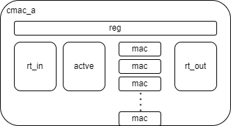
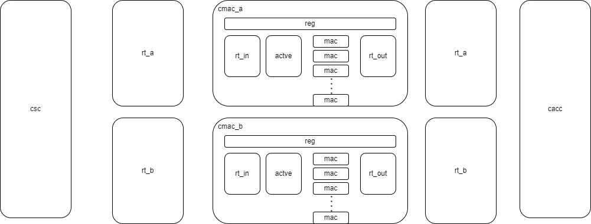
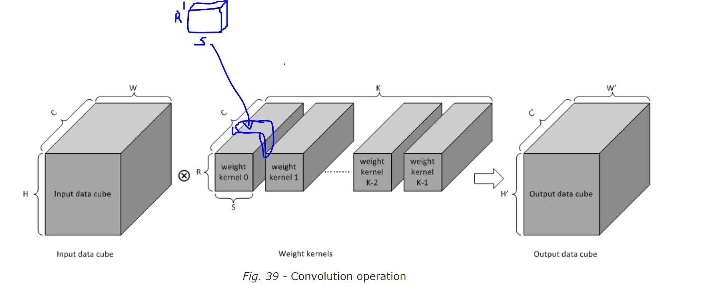
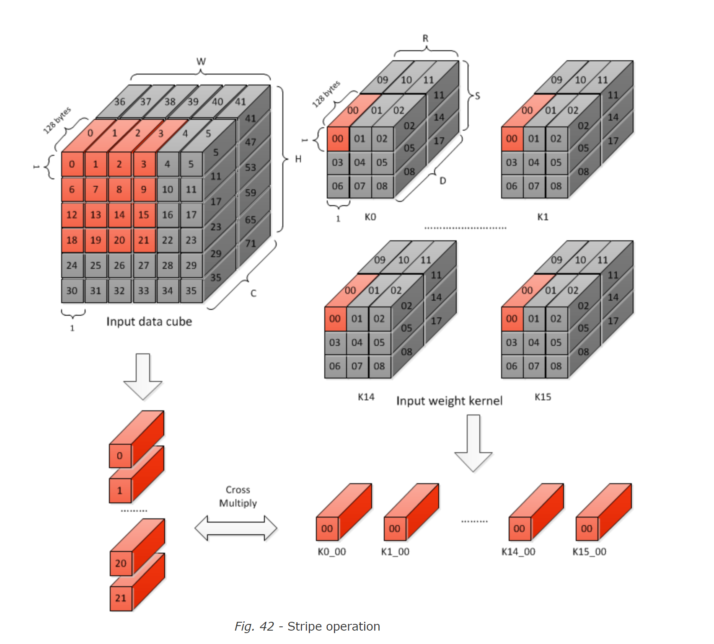

# CMAC 

CMAC consists of active, mac, rt_in and rt_out. They are mostly pipe stages as below.

```
rt_in => active => mac => rt_out

```

rt means retiming, it is a technique when a large combinational logic cannot finish within a clock or a data transfer cannot arrive within a clock. 

In the large combinational logic situation, happened in cmac_core_mac, for example, a mac is a large combinational logic, and it's impossible to let it finish within one clock, a feasible way is to insert another retiming logic. The retiming logic has a valid and mask signal, valid is to show whether the data is valid, mask is to mask the data output, valid and mask will delay some clocks to the output. So the data will be valid after several clocks appears to the output.

In the data transfer situation, happened in cmac_core_rt_in and cmac_core_rt_out, if the data path in physical design is long, rt will remedy the length of the data transfer, and it cannot be replaced by FIFO method, since FIFO in physical design is only a sram, the path delay still exists.

## CMAC Hierarchy View



rt_in, active, mac, rt_out forms CMAC_core. Configuration register has two situations: 1. In small or large configuration cases, the bpe is defaulted to be int8, register only do the op_en function, which is to shut down the CMAC_core. 2. In full configuration cases, in addition to op_en function, register can switch between fp16 or int8(not included in all soDLA, soDLA can only support small or large type).

From floorplan perspective, cmac looks like below(I would name it floorplan view, but it is not actually a floorplan):



cmac is actually a pipeline structure, the data producer is csc, and the consumer is cacc. 
rt_a and rt_b are the retiming blocks to relief the path delays. 

## CMAC Register File

Register in CMAC is in ping-pong style. 


## CMAC Configurations


```
class cmacConfiguration extends project_spec
{
    val CMAC_BPE = NVDLA_BPE //bits per element
    val CMAC_ATOMC = NVDLA_MAC_ATOMIC_C_SIZE 
    val CMAC_ATOMK = NVDLA_MAC_ATOMIC_K_SIZE
    val CMAC_ATOMK_HALF  = CMAC_ATOMK/2
    val CMAC_INPUT_NUM = CMAC_ATOMC  //for one MAC_CELL
    val CMAC_SLCG_NUM = 3+CMAC_ATOMK_HALF
    val CMAC_RESULT_WIDTH = NVDLA_MAC_RESULT_WIDTH    //16b+log2(atomC)
    val CMAC_IN_RT_LATENCY = 2   //both for data&pd
    val CMAC_OUT_RT_LATENCY = 2   //both for data&pd
    val CMAC_OUT_RETIMING = 3   //only data
    val CMAC_ACTV_LATENCY = 2   //only data
    val CMAC_DATA_LATENCY = (CMAC_IN_RT_LATENCY+CMAC_OUT_RT_LATENCY+CMAC_OUT_RETIMING+CMAC_ACTV_LATENCY)
    val MAC_PD_LATENCY = (CMAC_OUT_RETIMING+CMAC_ACTV_LATENCY-3)     //pd must be 3T earlier than data
    val RT_CMAC_A2CACC_LATENCY = 2
    val RT_CMAC_B2CACC_LATENCY = 3

    val PKT_nvdla_stripe_info_stripe_st_FIELD = 5
    val PKT_nvdla_stripe_info_stripe_end_FIELD = 6
    val PKT_nvdla_stripe_info_layer_end_FIELD = 8

}
```

This is a double for-loop(nvdla is a 2-d architecture, the convolution is planar). Within the csc, it will count the stripe, then layer. As mentioned in the CMAC Hierarchy view, cmac is splitted into two identical groups for better timing in physical design, they are cmac_a and cmac_b. To take an example of cmac_a, cmac_a has half of the CMAC_ATOMK mac lanes, each mac is to calculate the mac value within a kernel. 

In C'WHC version(open-source version), each k-lane is individual, representing a planar(W-H) piece of data in the channel of the kernel. 



if the k-lane is from the same kenel, different channel, then the result would be summed, thus the channel is reduced.  

Below is from the nvdla unit description from nvdla docs. 



Each lane means a kernel, and they share the same piece of data. 

PKT_nvdla_stripe_info_stripe_st* and PKT_nvdla_stripe_info_layer* is the status of the double for-loop shared with cacc. Layer is the outer loop, and stipe is the inner loop. 

## Each Lane is a channel from a Weight Kernel

As mentioned in the last sub-chapter, each lane means a kernel, and they share the same piece of data. Kernel, what is different from data cube is that weight during a convolution doesn't change. In order to cache the weight, a shadow stage is inserted in the cmac_active as below:

```
wt : in --> pre --> sd --> actv 
dat: in --> pre ---------> actv
```

The logic of the shadow stage is as following:

In the start of the stripe, shadow stage will store the new weight, in neither start nor end of the stripe, active stage will keep using the weight from shadow stage, in the end of the stripe, weight will be invalid. There is a stripe_st and stripe_end signal to indicate this behavior. 

## Reduction of ATOMIC_C

A Stripe of dat cube is reshaped into several ATMOIC_C(atomic_c is within the channel c), each of the k-lane(kernel-based mac lane) is performing an operation

```
sum = w0*dat0 + w1*dat1 + w2*dat2 + ... + w(c-1)*dat(c-1)
```

We can say, a information of ATOMIC_C is reduced. 

## MAC_RESULT_WIDTH Calculation

In the integer mac operations, the result of a mac is 2*bpe + log2(c), the result would be truncate further in cacc stage. In the floating point operations, the result remains unchanged. 


## From SystemC Point of View


In cmac/gen/cmac_a_reg_model.cpp, describe the register behaviour. 


