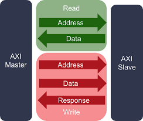
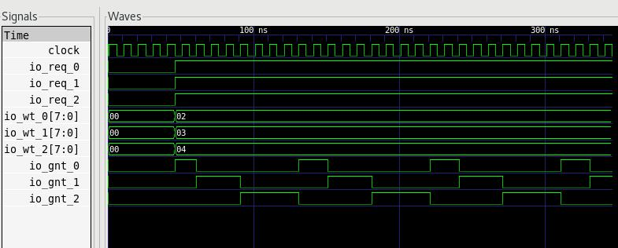

# MCIF Design


MCIF is a arbitration mechanism to arbit the axi4 request from data processors. The data processors include convolution processors, single data point processors, planar data point processors. Each of the data processors within nvdla are axi masters, and the slaves are other processors from NOC spaces. 

The following is a classic axi4 structure. About axi4 explanation, if you want to explore more, there is a more detailed video from Mr Dillon Huff(https://www.youtube.com/watch?v=1zw1HBsjDH8&t=10s, non-youtube-link https://www.bilibili.com/video/BV1Kh41127yN/?spm_id_from=333.337.search-card.all.click). Mr Dillon Huff is also an activate open-source maintainer. 




Each axi4 request has 5 channels, in the read category, there are two channels, 

master needs to provide the address(1st channel), 

master get the corresponding data(2nd channel). 

In the write category, there are 3 channels,

master will write the address(3rd channel),

master will get the corresponding data(4th channel),

then get back the responce from the axi slave(5th channel). 

So totally 5 channels. 

MCIF needs to separate those channels into different catagories in read channels and write channels, and then arbitrate them. Data processors, like cdma_dat(data channel from CDMA) and cdma_wt(weight channel from CDMA) only has read function. Other data processors, like SDP, has not only read, but also write. So separate and arbitrate those channels are MCIF's work. As for splitting the data and command, those are the works for WDMAs. 

Another terminology is ingress and exgress. Those are the words to describe the directions from CPU or memory side. 1st, 3rd, 4th channel are ingress. 2nd and 5th are exgress. Ingress need arbitrate the data from the data processor to the memory side, and exgress don't need to arbitrate, exgress is a broadcast mechanisim which only need to compare the axi-id. 

In the NV_NVDLA_XXIF_config.scala:

```
  val NVDLA_DMA_RD_IG_PW = NVDLA_MEM_ADDRESS_WIDTH+11
  val NVDLA_DMA_WR_IG_PW = NVDLA_MEM_ADDRESS_WIDTH+13
```

IG means ingress, in the read ingress, additional info are needed to provided. Below is the NVDLA_DMA_RD_IG_PW corresponding data. 

//ftran(1 bit), ltran(1 bit), out_odd(1 bit), out_swizzle(1 bit), out_size(3 bit) bpt2arb(address_width), axid(4 bit)

In the write ingress, additional info are needed to provided. Below is the NVDLA_DMA_WR_IG_PW corresponding data. 

// ftran(1 bit), ltran(1 bit), inc(1 bit), odd(1 bit), swizzle(1 bit), size(3 bit), addr(address_width), require_ack(1 bit), axid(4 bit)

ftran, ltran are first transitions and last transitions, they are functional. inc means incremental, has the same definition as axi4, is default to be 1 and cannot be modified. 
odd is the parity check info. Swizzle is always disabled. Size is the size of data to transfer. Require ack means want an acknowlegdge siganl from CPU after the last transfer. axi-id is the same as defined in axi4, it is a special number to recognize. Data processors, each of them, has an axi-id to connect to MCIF. 

If you want to customize your own data processor, one way is to add a small one, give it an axi-id, and connected to the MCIF. A benefit of it, is that you don't have to add another NOC endpoint for your own data processor. The disadvantage of might be occupying the bandwidth of the original nvdla. 

## Block Hierarchical Review

Within MCIF, there are three modules, u_csb, u_mcif_read, u_mcif_write. 

u_csb is a type of configuration register, different from the commonly used ping-pong register in NVDLA, u_csb has only one set of register, while ping-pong register requires two registers(in ping-pong, there are two groups, one is active, another is shadow, it means you can configure one register during the runtime, another group is still working). The reason of this might be MCIF is not a real data processor, if you go over the MCIF configurations 

```
NVDLA_MCIF_CFG_RD_WEIGHT_0_0

NVDLA_MCIF_CFG_RD_WEIGHT_1_0

NVDLA_MCIF_CFG_RD_WEIGHT_2_0
```

Those are the priorities for each of the data processors during the arbitration stage, and there is no op_en(operation enable) signal. Means the MCIF could be configured at the very begin stage. Those configurations will not be partipated in the real-time programming stages.


u_mcif_read's main purpose is to send read request from nvdla to memory, and get back the data. There are two channels, address and data, since the direction of read address is ingress, and read data is exgress, so the two channel is named read_ig and read_eg. 


u_mcif_write has three actions, send the address, send the data, and get back the write response from the memory side. Sending the address and data are ingress. 


As mentioned earlier, u_mcif_read and u_mcif_write would classify those request into two catagories, ingress and exgress, ingress requires arbitrate, and exgress requires broadcast. Arbitrating or broadcasting determine the actions of u_mcif_read and u_mcif_write. To take an example of u_mcif_read, it is divided into ingress module and exgress module. In the ingress module, there are three parts, bpt, arb, and cvt. bpt can be viewed as a pre-stage, arb is the arbitration stage, and cvt is the converting stage after arbitration. 


In the bpt type of module, you can see lots of calculations, even a performace counter to calculate the latency count. However, those are only calculated within one-cycle, all of it is to generate an address or a sequence of data. The first two pipes are only for the timing-closure. 

``````
address-only bpt(rdma):

wait-->[first pipe]-->wait-->[second pipe]-->calculate the ltran, ftran, swizzle, addr....[third pipe] --> to arb

or mixed-type bpt(wdma) 

wait-->[first pipe]-->wait-->[second pipe]-->if it is an address, calculate the ltran, ftrain, swizzle, addr, if it is a data sequence, find out whether it is a cmd or dat type and generate the corresponding sequence....[third pipe] --> to arb

``````

In the arb type of module, it is an arbiter with priority(or weight), priority info finally passed to this module. The waveform is like below:



In the cvt type of module, in addition to reformat the data, another cvt's work is to get the outstanding transaction numbers. The outstanding in Puvan Kumar in Quora's answer is "In simple words: The number of requested trasactions for which master didn't receive response from slave are called outstanding Transactions.". We have the same definition here, means a rdma is requesting a data, but wdma hasn't received yet. cvt module is the closed to NOC, so cvt would collect the outstanding info. 

Next subchapter will go over more details in rdma and wdma modules.

## READ_IG_bpt

A read_ig_bpt's function is to collect the address request from rdma(the size of it is NVDLA_DMA_RD_REQ = NVDLA_MEM_ADDRESS_WIDTH + NVDLA_DMA_RD_SIZE, NVDLA_MEM_ADDRESS_WIDTH is 32 in small configuration, NVDLA_DMA_RD_SIZE is 15), and reformat it into  

```
//ftran(1 bit), ltran(1 bit), out_odd(1 bit), out_swizzle(1 bit), out_size(3 bit), bpt2arb(address_width), axid(4 bit)
```

There's a parameter NVDLA_MCIF_BURST_SIZE is needed during the reformatting step, although NVDLA_PRIMARY_MEMIF_MAX_BURST_LENGTH or PRIMARY_MEMIF_MAX_BURST_LENGTH is defaulted to be 1, means no burst operation between mcif to noc.


## READ_eg

read_eg's function is to receive the corresponding data to 


