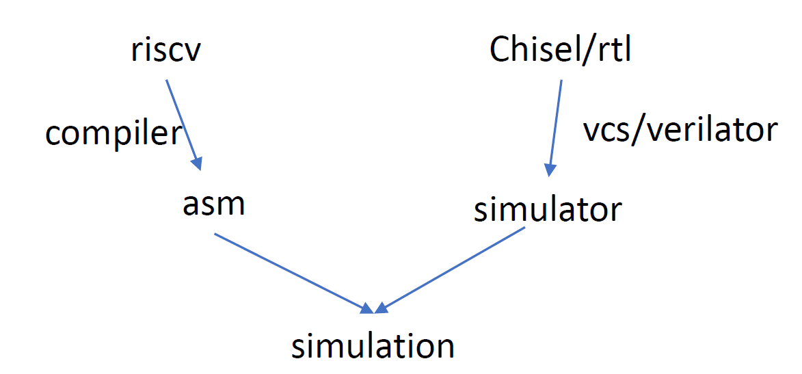
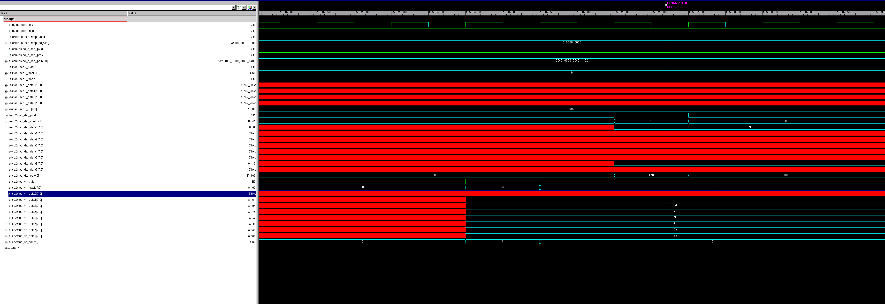

## SODLA Verification Environment

The whole verification environment in soDLA is accomplished by chipyard as follows



riscv-toolchain as a compiler, will compile the testing program. And soDLA rtl is compiled by vcs/verilator. 

In the test/test_case/include/ape_small_single.h, provides the register address(or the KMD information). Application program is the ape_single.c 

Take an example of dc_1x1x8_1x1x8x1_int8, the weight file is ape_get_ali3_data.c, totally 8 kernels in the weight, they are the first two elements

```
0x75946100,0xaa8efd3f
```

Read in the last 8 weight kernel as:



The corrensponding data is:

```
0x0000006f,0x00100000
```

The data is one-dimentional, 

