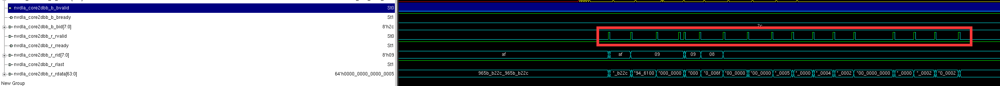

## SODLA Verification Environment

The whole verification environment in soDLA is accomplished by chipyard as follows


riscv-toolchain as a compiler, will compile the testing program. And soDLA rtl is compiled by vcs/verilator. 

In the test/test_case/include/ape_small_single.h, provides the register address(or the KMD information). Application program is the ape_single.c 

Take an example of dc_1x1x8_1x1x8x1_int8, the weight file is ape_get_ali3_data.c, totally 8 kernels in the weight. They are the first two elements

```
0x75946100,0xaa8efd3f
```

Read in the last 8 weight kernel as:


The corrensponding data is:

```
0x0000006f,0x00100000
```

Although in the axi-mem-read shows the behaviour that the memory read 17 times, each read is 16 byte, as follows:

```
data[1st 16 byte],
weight[1st 16 byte],
data[2nd 16 byte],
data[3rd 16 byte],
...
data[16th 16 byte]

```



The data from 2nd to the 16th are redundant, namely, shallow read, which is too shallow to be processed to the result. 

The final result of dc is the dot product, which is weight_0*dat_0+weight_1*dat_1+...+weight_15*dat_15


